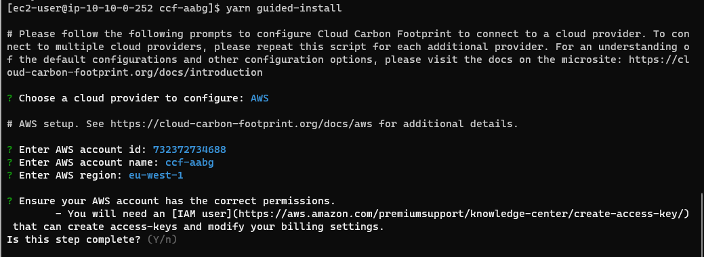

# cloud_carbon_footprint

Make sure there is no yarn.lock file in user's home directory or at the location you are installing the app.

    npx @cloud-carbon-footprint/create-app@latest

Named app as ccf-aabg

    cd ccf-aabg

This will guide you with required permission for IAM role, required services and data source to fetch the details etc
  
    yarn guided-install

  

  And start the app

    yarn start

  You can just run yarm install if you don't want it to configure with AWS data yet.

    yarn install

  start the app

    # if you are using yarn start instead of yarn guided-install
    yarn start-with-mock-data

Need to have an IAM role created which ec2 instance profile can assume with below permission. This is cloudformation compatible YAML.

    Parameters:
      AuthorizedRole:
        Description: The trusted entity's ARN that can assume the CCF role
        Type: String
        Default: arn:aws:iam::732372734688:role/ccf-aabg-api-role
      BillingDataBucket:
        Description: The S3 bucket where the CUR data lives
        Type: String
        Default: arn:aws:s3:::ccf-aabg-t1-billing
      QueryResultsBucket:
        Description: The S3 bucket where Athena query results will be stored
        Type: String
        Default: arn:aws:s3:::ccf-aabg-t1-athena
    Resources:
      CCFAthenaRole:
        Type: 'AWS::IAM::Role'
        Description: This role allows Cloud Carbon Footprint application to read Cost and Usage Reports via AWS Athena
        Properties:
          RoleName: 'ccf-app'
          AssumeRolePolicyDocument:
            Version: 2012-10-17
            Statement:
              - Effect: Allow
                Principal:
                  AWS: !Ref AuthorizedRole
                Action: sts:AssumeRole
          Policies:
            - PolicyName: athena
              PolicyDocument:
                Version: 2012-10-17
                Statement:
                  - Effect: Allow
                    Action:
                      - athena:StartQueryExecution
                      - athena:GetQueryExecution
                      - athena:GetQueryResults
                      - athena:GetWorkGroup
                    Resource: '*'
            - PolicyName: glue
              PolicyDocument:
                Version: 2012-10-17
                Statement:
                  - Effect: Allow
                    Action:
                      - glue:GetDatabase
                      - glue:GetTable
                      - glue:GetPartitions
                    Resource: '*'
            - PolicyName: s3
              PolicyDocument:
                Version: 2012-10-17
                Statement:
                  - Effect: Allow
                    Action:
                      - s3:GetBucketLocation
                      - s3:GetObject
                      - s3:ListBucket
                      - s3:ListBucketMultipartUploads
                      - s3:ListMultipartUploadParts
                      - s3:AbortMultipartUpload
                      - s3:PutObject
                    Resource:
                      - !Ref BillingDataBucket
                      - !Join [ "", [ !Ref BillingDataBucket, "/*"] ]
                      - !Ref QueryResultsBucket
                      - !Join [ "", [ !Ref QueryResultsBucket, "/*"] ]
            - PolicyName: ce
              PolicyDocument:
                Version: 2012-10-17
                Statement:
                  - Effect: Allow
                    Action:
                      - ce:GetRightsizingRecommendation
                    Resource: '*'
